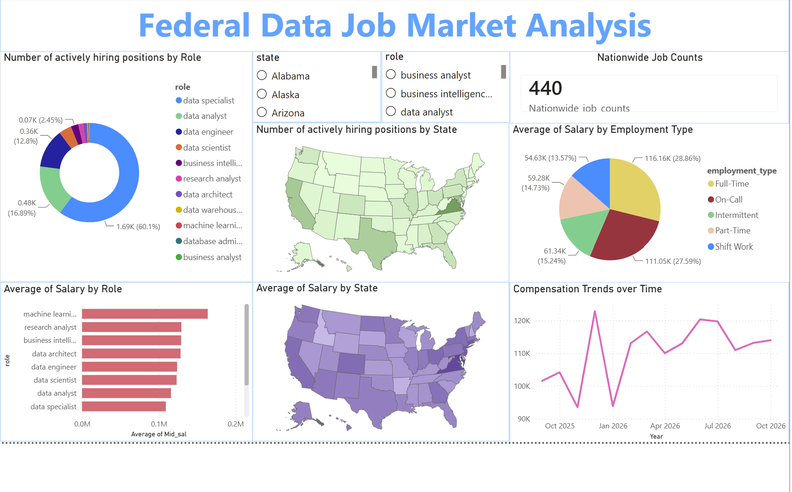
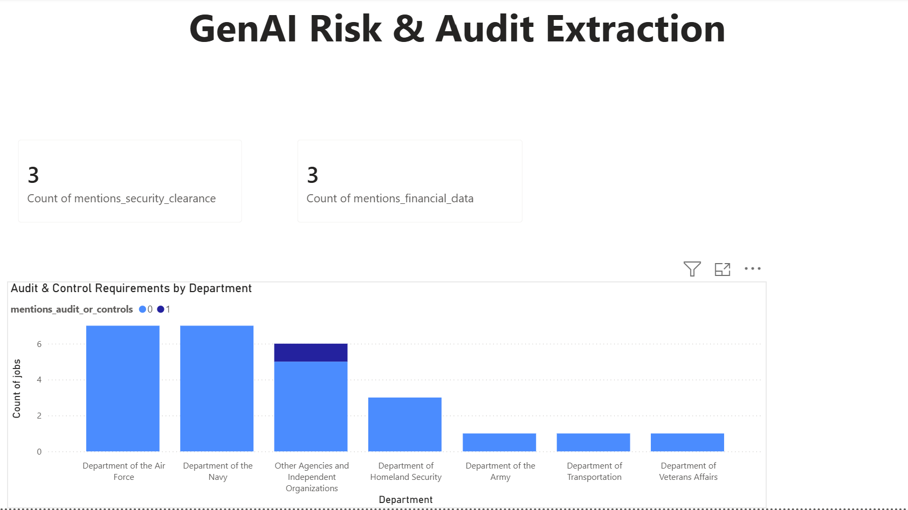
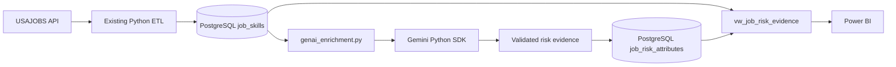

# 📊 Federal Data Job Market Analysis & ETL Pipeline

An end-to-end data engineering and analytics project that collects, cleans, transforms, and analyzes federal data-related job postings from the **USAJOBS API**.

The project combines a modular Python ETL pipeline, PostgreSQL database, exploratory analysis, and Power BI dashboard to turn raw federal job postings into a structured dataset for understanding **job demand, salary, geography, employment type, and role distribution** across the U.S.

---

## 🔗 Project Links

* **✨ Live Project Walkthrough:** [Explore the Interactive Project Page](https://hatranusf.github.io/NextLeg/)
* **📁 GitHub Repository:** [View the Source Code](https://github.com/HaTranUSF/Job-Market-Analysis)
* **📊 Power BI Dashboard:** `Federal_Data_Job_Market_Analysis.pbix`

---

# 📈 Dashboard & Analytical Findings

The output is presented across a two-page Power BI dashboard combining macro-level job market intelligence with an experimental AI-driven risk evidence extraction module.

### Page 1: Macro Market Overview



#### Key Findings (Macro Market):
* **Role Dominance:** **Data Specialists** dominate active hiring volume, comprising **60.1% (1.69K)** of actively open positions, followed by **Data Analysts (16.89% / 0.48K)** and **Data Engineers (12.8% / 0.36K)**.
* **Nationwide Volume:** **440** total active federal posting positions tracked across the nationwide sample.
* **Compensation Trends:** 
  * Average compensation peaked above **$120K** in early 2026, maintaining a stable baseline above $110K through late 2026.
  * **Full-Time** roles command the largest slice of higher average salary bands (28.86% @ ~$116.16K average), while **Part-Time** roles average around $59.28K.
* **High-Paying Specializations:** **Machine Learning Engineers** and **Research Analysts** yield the highest average mid-range salary tiers across federal role categories.

---

### Page 2: GenAI Risk & Audit Extraction (Experimental Feature)



> ⚠️ **Experimentation & Sample Size Note:** Page 2 serves as a **Proof-of-Concept (PoC)** dashboard evaluating automated LLM risk and compliance extraction. To operate within free-tier API rate limits (`15 RPM`) and control generation costs during development, processing was intentionally capped to a **pilot sample batch (26 postings)**. The infrastructure is fully designed for scalable, idempotent batch ingestion across the full PostgreSQL database.

#### Key Findings (GenAI Audit & Control Pilot):
* **Security & Financial Risk Detection:** Extracted **3 explicit mentions** of required **Security Clearances** and **3 explicit mentions** involving access to sensitive **Financial Data** within the pilot sample.
* **Departmental Concentration:**
  * The **Department of the Air Force** and **Department of the Navy** led in total postings screened for audit controls.
  * **Other Agencies and Independent Organizations** demonstrated the highest concentration of explicit compliance and internal control enforcement requirements (`mentions_audit_or_controls = 1`).
* **Zero-Hallucination Evidence Grounding:** 100% of extracted risk flags are directly verified against verbatim quote snippets from the original job description text in PostgreSQL.

---

# 🎯 The Business Problem

The federal data job market contains thousands of job postings with different titles, descriptions, salary formats, employment types, and locations.

Looking at individual postings makes it difficult to answer broader questions such as:

* Which data-related roles account for the largest share of opportunities?
* How are opportunities distributed geographically?
* How does compensation vary across roles?
* How does salary differ by employment type?
* What does the current federal data-job market look like after standardizing inconsistent source data?

The challenge is therefore not simply collecting job postings. It is turning messy, semi-structured job data into a consistent dataset that can support meaningful analysis.

### Business Question

> **How can we build a repeatable data pipeline that transforms raw federal job postings into a reliable dataset for analyzing data-job demand, compensation, and geographic patterns?**

---

# 💡 The Solution

We built a production-style ETL pipeline that:

1. **Extracts** job postings from the USAJOBS API
2. **Transforms** raw postings into standardized analytical records
3. **Classifies** postings into data-related job categories
4. **Normalizes** compensation and other fields
5. **Filters** the dataset to U.S.-based data-related positions
6. **Loads** the cleaned data into PostgreSQL
7. **Exports** database snapshots for downstream use
8. **Analyzes** the resulting dataset through exploratory analysis
9. **Visualizes** the results in Power BI
10. **Optionally enriches** job-description evidence with Gemini for downstream risk analytics

```text
                 USAJOBS API
                      │
                      ▼
              ┌──────────────┐
              │    Extract   │
              │  extract.py  │
              └──────┬───────┘
                     │
                     ▼
              ┌──────────────┐
              │   Transform  │
              │ transform.py │
              └──────┬───────┘
                     │
          ┌──────────┴──────────┐
          │                     │
          ▼                     ▼
   Job Standardization     Skill Extraction
          │                     │
          └──────────┬──────────┘
                     ▼
              ┌──────────────┐
              │     Load     │
              │    load.py   │
              └──────┬───────┘
                     │
                     ▼
                PostgreSQL
                     │
            ┌────────┴────────┐
            ▼                 ▼
      Data Analysis       CSV Snapshots
            │
            ▼
        Power BI

---

# 📥 1. Data Extraction

The pipeline uses the **USAJOBS API** to retrieve federal job postings associated with data-related roles.

The extraction workflow is implemented in:

```text
extract.py
```

The pipeline searches across a defined set of data-related roles, including:

* Data Analyst
* Data Scientist
* Data Engineer
* Business Analyst
* Machine Learning Engineer
* Analytics Engineer
* Data Specialist
* Research Analyst
* Business Intelligence Analyst
* Data Architect
* Data Warehouse Engineer
* Database Administrator

The extraction process includes several safeguards for working with an external API:

* API pagination
* Persistent HTTP connections
* Explicit request timeouts
* Bounded retry and backoff behavior
* Handling of temporary API errors
* Tracking of fetched posting IDs

The recorded notebook extraction contains **5,588 raw postings** before the subsequent transformation and filtering steps.

---

# 🧹 2. Data Transformation

Raw USAJOBS postings contain inconsistent titles, descriptions, locations, dates, salary formats, and other fields.

The transformation workflow is implemented in:

```text
transform.py
```

It converts the raw API response into a structured analytical dataset.

### Role Classification

The pipeline applies rules-based classification to standardize job titles into data-related categories.

The classification logic distinguishes roles such as:

* Data Analyst
* Data Engineer
* Data Scientist
* Machine Learning Engineer
* Analytics Engineer
* Business Analyst
* Business Intelligence Analyst
* Data Architect
* Data Warehouse Engineer
* Database Administrator
* Data Specialist
* Research Analyst

The transformation also applies exclusions to prevent unrelated postings from being included in the analytical dataset.

### Location Standardization

Location information is parsed into structured geographic fields.

The analysis is restricted to U.S. locations, including the 50 states and Washington, D.C.

### Salary Normalization

Salary information is converted into a consistent annualized representation.

For salary values below `$500`, the pipeline treats the value as an hourly rate and annualizes it using:

```text
2,080 hours/year
```

This matches the convention used in the analysis notebook.

### Date and Employment Standardization

The pipeline also standardizes fields such as:

* Application dates
* Start dates
* Employment type
* Job grade
* Remote status
* Location

---

# 🔗 3. Skill Extraction

The transformation pipeline also creates structured job-to-skill relationships.

Skills are extracted from job-posting content and stored separately from the main job records.

The database uses:

```text
job_skills
```

for job postings and:

```text
job_posting_skills
```

as the bridge table connecting postings to extracted skills.

This creates a many-to-many relationship between jobs and skills.

### Important Limitation

Skill extraction was explored as part of the project, but the resulting skill data was not considered reliable enough to use for the primary dashboard analysis.

The project therefore does **not** make claims about overall skill dominance such as "SQL appears in X% of postings."

This was an intentional data-quality decision rather than presenting potentially noisy skill results as definitive market findings.

---

# 🗄️ 4. PostgreSQL Data Layer

The current production pipeline uses **PostgreSQL** as its database.

Database configuration and schema creation are handled by:

```text
engine.py
```

The loading process is implemented in:

```text
load.py
```

The primary tables are:

### `job_skills`

Contains the structured job-posting records, including fields such as:

* Job ID
* Role
* Title
* Organization
* Department
* City
* State
* Description
* Posting dates
* Salary
* Employment type
* Remote status

### `job_posting_skills`

A bridge table containing relationships between job postings and extracted skills.

This structure allows one job posting to be associated with multiple skills.

---

# 🔄 5. Incremental & Transactional Loading

The pipeline is designed to update the current dataset without simply replacing the entire database.

The loader:

* Refreshes postings returned by the latest API extraction
* Preserves older postings that are not returned by the latest response
* Uses database transactions during loading
* Removes duplicate job-skill relationships
* Protects posting IDs and job-skill pairs with unique indexes
* Prevents a zero-result extraction from replacing existing data

### Content-Based Deduplication

The pipeline also checks for duplicate postings based on their posting content rather than relying only on the source ID.

This helps identify cases where identical job postings appear under different source IDs.

---

# 📊 6. Exploratory Data Analysis

The exploratory analysis is documented in:

```text
experimentation/Pipeline_for_Data_Job_Market_Analysis.ipynb
```

The notebook examines the transformed job dataset and supports the analysis presented in the dashboard.

Areas explored include:

* Job role distribution
* Salary patterns
* Geographic distribution
* Employment type
* Job grades
* Data volume through the transformation pipeline

The notebook also contains the project's earlier pipeline experimentation and transformation work.

---

# 📈 7. Power BI Dashboard

The final analytical output is presented through Power BI.

The dashboard is designed around several business questions.

### Job Market Distribution

Examines the distribution of federal data-related job postings across role categories.

In the current dashboard analysis:

* **Data Analyst:** 34.5%
* **Data Engineer:** 32.1%

Together, these two categories represent **66.6%** of the analyzed postings.

### Geographic Analysis

The dashboard examines:

* Job postings by state
* Average salary by state
* Geographic concentration of opportunities

### Compensation Analysis

The dashboard compares compensation across:

* Job roles
* States
* Employment types
* Other available job attributes

### Employment Analysis

The dashboard provides an overview of job volume and compensation patterns across different employment types.

---

# GenAI Risk Evidence Extraction

This opt-in enrichment demonstrates how GenAI can support an Internal Audit / Risk Analytics workflow as a **data-enrichment processor**. Gemini reads one job description at a time and extracts explicitly stated indicators—such as references to personal, financial, or health data; security clearance; regulations; audit controls; privileged access; technical skills; systems; and financial responsibilities. Each returned evidence snippet is checked against the original description before it is stored.

The model is not asked to assign a risk score or decide whether a posting is fraudulent, illegal, or non-compliant. A mention is evidence for later deterministic control tests and human review, not a finding or conclusion. For example, an analyst could route postings that explicitly mention privileged access and financial systems to a control-review checklist; the model does not decide whether that access is inappropriate. Model confidence is a self-reported extraction confidence, not a calibrated probability.



## Storage and idempotency

The enrichment module adds `job_risk_attributes`, keyed by `posting_id` and linked to `job_skills.id` with `ON DELETE CASCADE`. Boolean mention flags, JSONB lists of extracted terms/skills/systems/data types/regulations/security and financial responsibilities, JSONB evidence snippets, confidence, description hash, model/prompt version, and processing time are stored separately; the existing ETL tables and behavior are left intact. A primary key and foreign key protect row identity and referential integrity. A confidence check restricts values to 0–1, and a GIN index supports JSONB term filtering.

The description hash, prompt version, and model name are checked when selecting work. Unchanged successful records are skipped; changed descriptions or model/prompt versions become eligible again. The upsert is keyed by posting ID, so reruns update the same row instead of inserting duplicates. Failed or invalid responses are logged and remain eligible for a later retry.

Structured output is generated with the official `google-genai` SDK and validated with Pydantic. Missing flags/lists default to false/empty, confidence is range-checked, and unsupported evidence quotations are removed; a positive boolean without a matching source quotation is reset to false. Only the description text is sent to Gemini. The input is a USAJOBS public posting, but review Google API terms and data-handling settings before using this with non-public descriptions.

## Configure and run

Install the added dependencies in the existing virtual environment:

```powershell
python -m pip install -r requirements.txt
```

Add `GEMINI_API_KEY` to the local, Git-ignored `.env` file. `GEMINI_MODEL` is optional and defaults to `gemini-3.8-flash`; no credential belongs in source control. Enrichment is separate from the ordinary ETL and is not run automatically. By default it selects at most **10** unprocessed descriptions, with one Gemini request per description and a two-second interval between requests:

```powershell
python genai_enrichment.py --limit 10
```

Use `--force --limit 10` to re-enrich up to ten selected records, even when unchanged. Increase pacing with `--request-interval 5` if your project receives 429 rate-limit responses. `--force` is still limited by `--limit`; the command does not automatically send the whole database. Each description is one logical extraction; transient retries may add requests and honor Gemini's `Retry-After` header when exposed by the SDK. Model usage/cost depends on each description's token length, model pricing, and response size; consult Google's current pricing and rate limits before increasing the limit. Transient rate-limit/server failures receive capped retries; other per-record failures log the API status and message and do not stop the rest of the batch.

**Model availability note:** Google's current model guide lists Gemini 2.5 Flash but restricts access to users who have actively used 2.5 models. This project account received a live 404 stating 2.5 Flash is unavailable to new users and recommending `gemini-3.8-flash`, so that is the configured default. A 503 is service-side capacity, not something the script can guarantee to avoid; bounded retries/backoff only make the run more resilient.

## Power BI connection

The enrichment module creates `public.vw_job_risk_evidence` alongside the new table. In Power BI Desktop, use **Get Data → PostgreSQL database**, connect to the same server/database as the ETL, and select `public.vw_job_risk_evidence`. The view left-joins risk evidence to postings and exposes posting ID, role, organization/agency, state, mention flags, evidence, confidence, model, and processing metadata. It includes unenriched postings with `is_enriched = false`; filter to `is_enriched = true` for counts and charts. Use distinct count of `posting_id` for posting counts, split/group by `role`, `state`, or `organization`, and use `evidence_snippets` as a drill-through/detail field. JSONB list columns may need expansion or conversion in Power Query depending on the PostgreSQL connector version.

The `.pbix` is a binary Power BI artifact and is not modified by this change. Its current connection and semantic model could not be verified from the repository, so connect the view and add visuals in Power BI Desktop rather than assuming automatic dashboard changes. Recommended visuals are mention-flag counts for sensitive, financial, personal, health, clearance, and regulatory references; evidence counts by role/state/agency; a confidence distribution; and a table of cited evidence snippets. These are mention/evidence counts, not risk scores or compliance findings.

For example, after loading the view, a distinct count measure for financial-data mentions can use:

```DAX
Financial-data postings =
CALCULATE(
     DISTINCTCOUNT('vw_job_risk_evidence'[posting_id]),
     'vw_job_risk_evidence'[is_enriched] = TRUE(),
     'vw_job_risk_evidence'[mentions_financial_data] = TRUE()
)
```

---

# 📌 Key Findings

Based on the current dashboard and project analysis:

### Data Analyst & Data Engineer Roles

Data Analyst and Data Engineer positions make up the largest portions of the analyzed dataset, accounting for **34.5%** and **32.1%**, respectively.

Together, they represent **66.6%** of the analyzed postings.

### Geographic Variation

Job opportunities and average compensation vary across U.S. states, providing a way to compare where federal data-related positions are concentrated and how compensation differs geographically.

### Role-Level Compensation

Salary distributions differ across job categories, allowing the dashboard to be used to compare compensation patterns between different data-related career paths.

> These findings describe the dataset collected through the USAJOBS-based pipeline. They should not be interpreted as a complete representation of the entire U.S. or global data-job market.

---

# 🧪 8. Data Quality & Testing

The project includes an offline test suite:

```text
tests/test_etl_job_market.py
```

The tests cover important transformation and loading behaviors, including:

* Posting deduplication
* Salary normalization
* Job-grade processing
* Employment-type processing
* Date parsing
* Location parsing
* Skill extraction

The separate `tests/test_genai_enrichment.py` suite covers structured-response validation, missing fields, evidence grounding, API retries/failure isolation, and idempotent upsert behavior. All Gemini responses are mocked in unit tests; tests never call the live API.

Run the test suite with:

```bash
python -m unittest discover -s tests
```

---

# 📤 9. Data Outputs

The ETL pipeline can generate database snapshots under:

```text
data/processed/
```

The generated outputs include:

```text
job_skills.csv
job_posting_skills.csv
```

`job_skills.csv` contains the persisted job-posting records.

`job_posting_skills.csv` contains the relationships between job postings and extracted skills.

The generated CSV files are ignored by Git and are not part of the committed repository.

---

# 🏗️ 10. Pipeline Architecture

The production pipeline is organized into modular Python components:

```text
extract.py
    │
    ├── USAJOBS API requests
    ├── Pagination
    ├── Retry / backoff
    └── Raw posting extraction
          │
          ▼
transform.py
    │
    ├── Data cleaning
    ├── Role classification
    ├── Location parsing
    ├── Salary normalization
    ├── Date normalization
    └── Skill extraction
          │
          ▼
load.py
    │
    ├── Transactional database updates
    ├── Posting replacement
    └── Skill relationship loading
          │
          ▼
engine.py
    │
    ├── PostgreSQL connection
    ├── Table definitions
    └── Unique indexes
          │
          ▼
PostgreSQL
          │
          ├──────────────► CSV snapshots
          │
          ▼
      Power BI
```

The entire workflow is orchestrated through:

```text
etl_job_market.py
```

---

# 📂 11. Repository Structure

```text
Job-Market-Analysis/
│
├── etl_job_market.py
│   └── ETL pipeline orchestrator
│
├── extract.py
│   └── USAJOBS API extraction
│
├── transform.py
│   └── Data cleaning, classification,
│       normalization, and skill extraction
│
├── load.py
│   └── PostgreSQL loading logic
│
├── genai_enrichment.py
│   └── Optional Gemini evidence extraction, schema/view, validation,
│       retries, and bounded command-line runner
│
├── engine.py
│   └── Database connection and schema definitions
│
├── tests/
│   └── test_etl_job_market.py
│       └── Offline ETL tests
│   └── test_genai_enrichment.py
│       └── Mocked GenAI validation and failure tests
│
├── experimentation/
│   ├── Pipeline_for_Data_Job_Market_Analysis.ipynb
│   └── airflow-jobs-pipeline/
│
├── Federal_Data_Job_Market_Analysis.pbix
│   └── Power BI dashboard
│
├── Dashboard.png
│   └── Dashboard preview
│
├── index.html
│   └── Interactive project walkthrough
│
├── requirements.txt
│   └── Python dependencies
│
├── .env.example
│   └── Environment variable template
│
├── .gitignore
│
└── README.md
```

---

# 🚀 12. Running the Pipeline

## Step 1: Clone the Repository

```bash
git clone https://github.com/HaTranUSF/Job-Market-Analysis.git
cd Job-Market-Analysis
```

## Step 2: Create the Environment

Install the required Python packages:

```bash
pip install -r requirements.txt
```

## Step 3: Configure Environment Variables

Copy the example environment file:

```bash
cp .env.example .env
```

Configure the required USAJOBS and PostgreSQL credentials.

Do not commit `.env` to Git.

## Step 4: Run the Full ETL Pipeline

```bash
python etl_job_market.py
```

The pipeline will:

1. Extract USAJOBS postings
2. Transform and standardize the data
3. Load the results into PostgreSQL
4. Generate CSV snapshots from the persisted database data

## Step 5: Run Without PostgreSQL

To perform extraction and transformation without loading the database:

```bash
python etl_job_market.py --skip-load
```

## Step 6: Run Tests

```bash
python -m unittest discover -s tests
```

---

# 💰 13. Architecture Evolution

The project originally used **Snowflake** during development.

After evaluating the scale and requirements of the project, the implementation was moved to **PostgreSQL**.

This resulted in a simpler architecture for the current dataset while preserving the modular ETL design.

```text
Original Prototype
Snowflake
    ↓
Evaluation of project scale/cost
    ↓
Current Implementation
PostgreSQL
```

The current repository therefore uses PostgreSQL as the production data layer. Snowflake is part of the project's development history rather than the current implementation.

---

# 🔮 14. Future Improvements

Potential next steps identified during the project include:

* Automating scheduled pipeline execution
* Expanding the number of data sources
* Improving skill extraction and validation
* Adding more robust historical job tracking
* Expanding analytical coverage
* Further improving the dashboard experience

---

# 🧠 15. Project Takeaway

This project demonstrates how a messy, semi-structured job-posting source can be transformed into a repeatable analytical workflow.

The core process is:

```text
USAJOBS API
     ↓
Extract
     ↓
Clean & Standardize
     ↓
Classify
     ↓
Normalize
     ↓
PostgreSQL
     ↓
Analyze
     ↓
Power BI
```

Rather than manually reviewing individual job postings, the pipeline creates a structured foundation for analyzing **which federal data roles are most common, where opportunities are concentrated, and how compensation varies across the market**.

The project combines data engineering and analytics to turn raw job-posting data into a business-facing data product.
